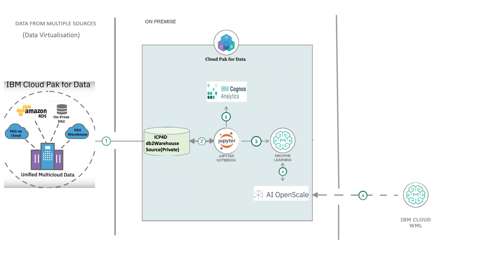
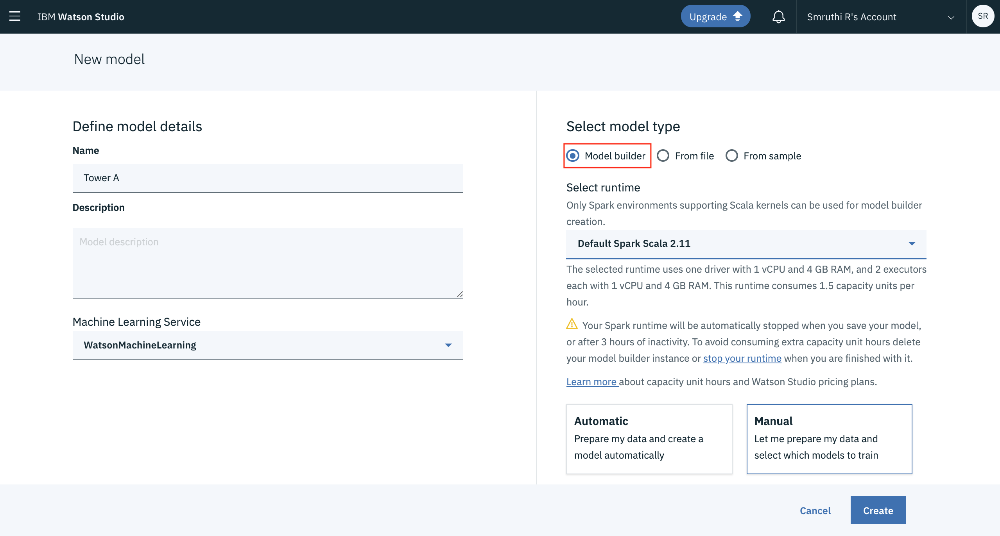
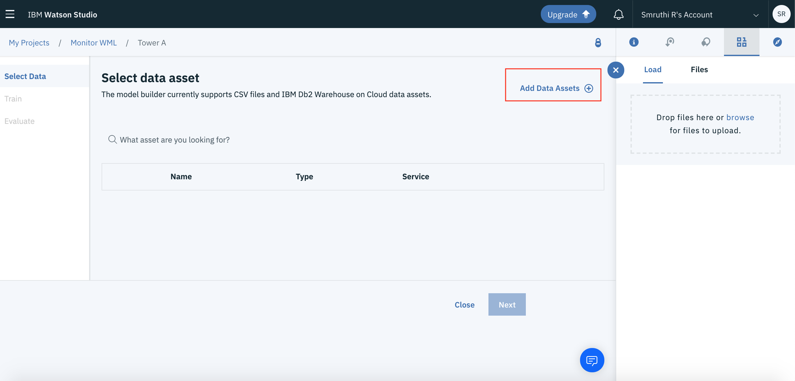
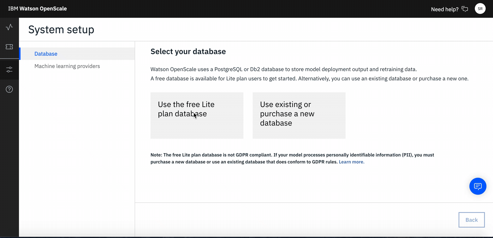
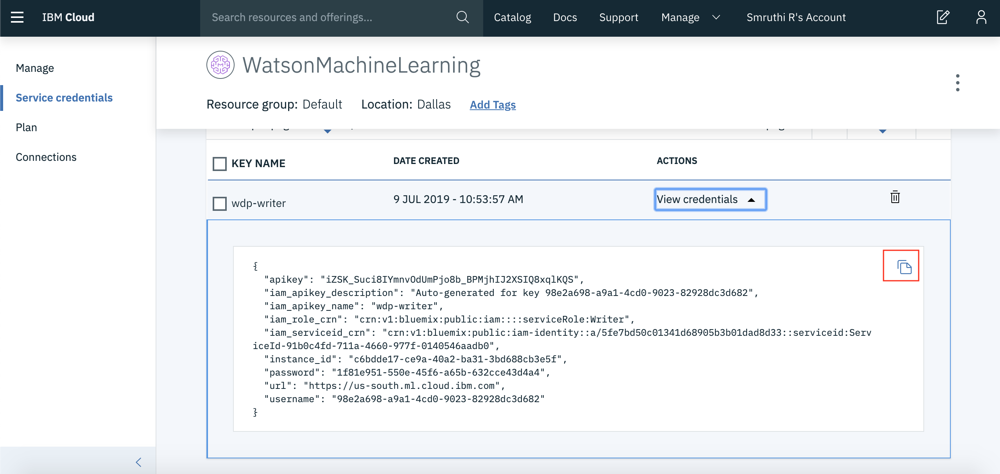
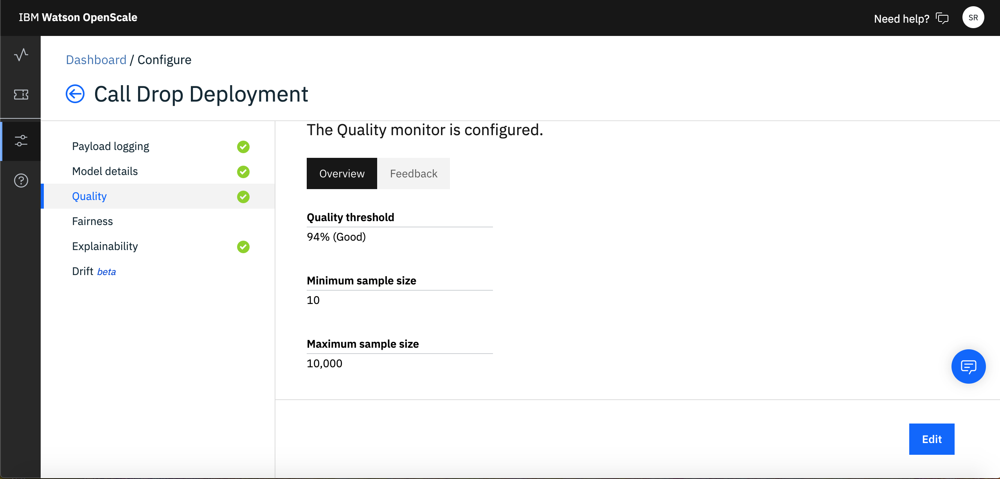
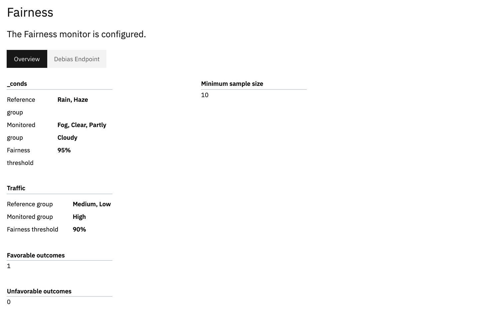
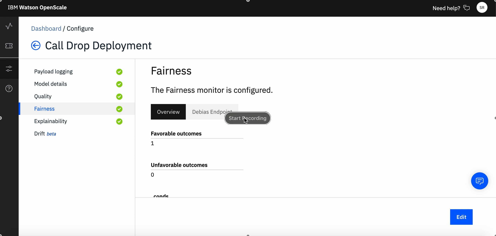
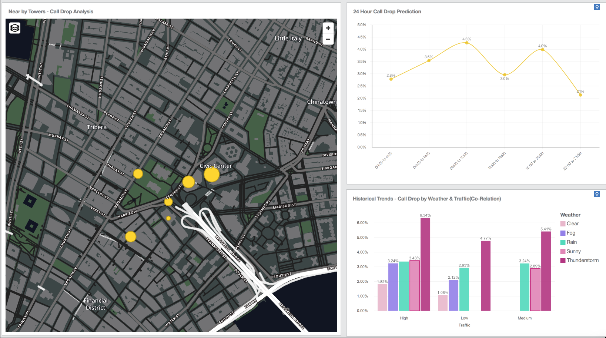
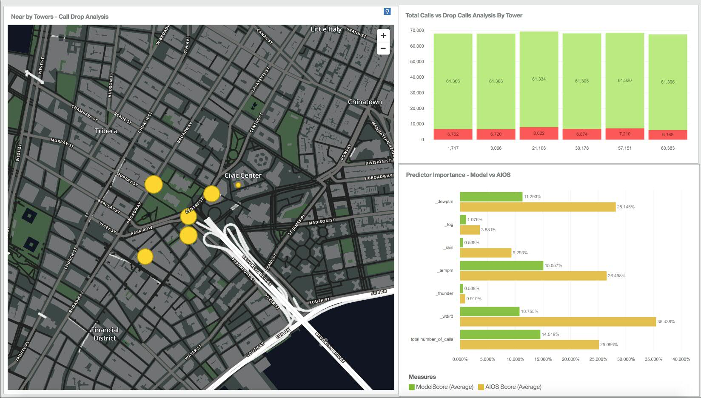

# Predict, Manage and Monitor the call drops of cell tower using Cloud Pack for Data

A call drop is a situation of disconnection of call before caller ends the call mostly on wireless networks. Some of the main reasons for Call-Drop are:

1. Inadequate coverage which can be due to multiple reasons
    * Lack of tower infrastructure
    * Improper network planning
    * Non-optimization of network

2. Overloaded cell towers – number of subscribers are growing day by day and most of them are on smartphones. The network capacity is simply not being ramped up at the same pace resulting in overloaded networks 
3. Cityscape changes – there have been instances where a new multistoried building comes up and the adjacent building’s subscribers lose cell reception. Such instances are very common with rapidly changing cityscapes and call for routine network data analysis from service providers.
4. Switching between towers – this situation occurs when a person is traveling or moving around while talking. If a call handover takes place from one BTS to another, especially in case of overloaded networks, there are chances of dropped calls.
5. Technical Failures – this is beyond anyone’s control and operators generally monitor downtimes through well-equipped network operation centers.

This Code Pattern Aims to Predict the Call Drop Prediction, trained on the above mentioned failures, so as to identify at an earlier stage and take necessary measures, with the help of an interactive dashboard (Embedded dashboard service
) that helps to understand the call drops with a Time Series Model. This will be benefit Telecomm Service to take the necessary action to improve the network coverage for their customers. The following are the main features of the solution-

* The solution will be built on IBM Cloud Pak for Data.
* Data maybe from multiple db sources, be it an internal Db2 Wh (SMP) within the Cloud Pak for Data instance or any external sources like Db2 on Cloud, Oracle db, Postgres Db and so on. Data Virtualisation will take place and all of them get integrated into one db source.
* A Time-Series Model that predicts next 24-hour call drop prediction using the built-in Notebook Service.
* A Call-Drop Prediction model for each cell tower, region-wise and these models monitored for quality and fairness using AI OpenScale.
* A Dashboard on Cognos Analytics will give a user an overall region-wise view of the call-drop scenarios, time-series model output in a graph and models performance improvement with the help of AI OpenScale.

After a user has completed this pattern they will learn how to-

1. Concept of Data Virtualization.
2. Create Connections from Dbs hosted on multiple Cloud (AWS, Azure or IBM Cloud) or On-Premise environments.
3. Create Views from joins and publish data to your current Project.
4. How to store custom models using open source technology on Watson Machine Learning.
5. How to deploy a model and connect the model deployment to Watson OpenScale on Cloud Pak for Data and on IBM Cloud.
6. How to setup Model Fairness and Model Quality montiors and Watson OpenScale on Cloud Pak for Data and on IBM Cloud, using      python notebook.
7. How to create a project and setup a python notebook on Cloud Pak for Data.


## Pre-requisites
* [IBM Cloud Pak for Data](https://www.ibm.com/in-en/products/cloud-pak-for-data) 
* [Data Virtualisation](Insert DV Tutorial)
* [Monitor your ML Models using Watson OpenScale](Insert code pattern link)
* [Building Dashboards in Cognos Analytics on IBM Cloud Pak for Data](Insert Cognos Dashboard Tutorial)

## Architecture Diagram

  
  
1. Data stored across various sources like, AWS Cloud, IBM Cloud is virtualised and joined as needed by the AI Models.
2. The joined data is stored back to the Internal Db of Cloud Pak for Data and Assigned to the current working project.
3. Create ML Models using Jupyter Python Notebooks to predict Call Drop, towerwise and also a Time Series Model that Projects a Call Drop % based real-time conditions.
4. Model trained and/or stored in Watson Machine Learning, which is also connected to the AI OpenScale.
5. Visualise and Analyse insights from the trained Models and the data using Cognos Analytics Dasboard. 
6. Configure Fairness, Quality and Explainability Montiors for each Tower's model, present within Cloud Pak for Data or on other external Clouds (Multi-Cloud Architecture).

## Steps
1. [Create a new Watson Studio Project]()
2. [Add a new Watson Machine Learning Model]()
3. [Build your own Machine Learning Model with WML Model Builder]()
4. [Create a new Watson OpenScale instance on IBM Cloud]()
5. [Create a new Watson Studio Python Notebook on IBM Cloud]()
6. [Launch the Watson OpenScale add-on on IBM Cloud Pak for Data]()
7. [Create a new Project in your IBM Cloud Pak for Data instance]()
8. [Run the Inital Scoring and Payload Logging]()
9. [Configure the Quality and Fairness Monitors on Watson OpenScale]()
10. [Add Feedback Data to setup your dashboard on Watson OpenScale]()


### 1. Create a new Watson Studio Project

* On IBM Cloud create a new [Watson Studio](https://cloud.ibm.com/catalog/services/watson-studio)

  
  
* Make sure to set the location to `Dallas`, select the appropriate plan and hit Create.
* Go to your [IBM Cloud Dashboard](https://cloud.ibm.com/)
* Click on `resources>services` select your Watson Studio Service and click on `Get Started`.
* Create a new Project as shown below-
  
  
  
* If you don't have a Cloud Object Storage Instance then follow the onscreen steps to create a new Cloud Object Storage Instance.

### 2. Add a new Watson Machine Learning Model

* Click on `Add to Project` and select `Watson Machine Learning` option.
* If you already have a WML instance, make sure it is in the `Dallas` region. If not, follow the steps as below-
  

```Note: Ensure your WML region is Dallas```
* Select `model type> model builder`
* Select `runtime> Default Spark Scala 2.11`
* Select the `Manual` option
  
* Give your model a name and hit create.

### 3. Build and Deploy your own Machine Learning Model with WML Model Builder

* Clone the repo using the `Clone or Download` button or by typing the below command in a desired directory in your command line.

```
    git clone https://github.com/IBM/icp4d-telco-monitor-models-with-wml-openscale.git
```
* In your IBM Cloud, open the created model. Click on `Add Data Assets`. Navigate to the [dataset](https://github.com/IBM/icp4d-telco-monitor-models-with-wml-openscale/blob/master/dataset/TowerC_train.csv) folder in the downloaded repo, add the file and select the file. 

  
  
* Once your dataset is loaded, setup the Target Column, Feature Column, Type of Classification or Regeression and an Estimator.

  
  
```
  Note: The parameters you set will be different from the above steps, in case of a different dataset and use-case.
```
* Once the model is trained click on `Save` and store your model.
* To Deploy the created model, go to `Deployments>Add a Deployment`

  

```
  Note: 
      1. If you are using IBM Cloud follow steps 4-5 and then continue with step 8
      2. If you are using IBM Cloud Pak for Data ignore next few steps and start from step 6
  
```

  
### 4. Create a new Watson OpenScale instance on IBM Cloud

* In your IBM Cloud, create an new [Watson OpenScale Instance](https://cloud.ibm.com/catalog/services/watson-openscale)
* Configure the Db for OpenScale. In this we use a Free-Lite Plan, you may choose any other db depending on your requirement.

  
  
* Bind your created WML instance to OpenScale, following the on-screen instructions as shown below-

  
  
 * Click on `Go to Dashboard`. Then select `Add Deployments`. Add the most recent deployment.
 
  
  
* Click on `Configure Monitors`. Select the appropriate data type and algorithm type, according to your custom model. If you are using the same dataset as our example, follow the below steps-
 
   
  
 
 ### 5. Create a new Watson Studio Python Notebook on IBM Cloud
 
 * Go back to your Watson Studio Project Landing Page.
 * Click on `Add to Project> Notebook`.
 * Go to the `From URL` tab and enter the notebook URL- 
  ``` Attach one Screenshot
  ```
  ### Configure Credentials
  * Open your WML instance from your IBM Cloud Dashboard.
  * Go to `Service Credentials` tab, click on `View Credentials` and copy it.
  
   
   
  * Open your Watson Studio notebook-
  * Paste the copied credentials in the `WML_CREDENTIALS` variable.
  
 ### 8. Run the Inital Scoring and Payload Logging
  * Insert the Pandas Dataframe of the Training Data
  
    
    
  * Run the Notebook. 
    ``` Add Details on Notebook running
    ```
    
  * Go back to Watson OpenScale and click on `I'm Finished`

### 9. Configure the Quality and Fairness Monitors on Watson OpenScale

  * Setup the Quality Monitor. This Quality Monitor has a threshold accuracy value that can be set to give an alert, if your model doesn't give a an accuracy below a certain level.
  
    
 * For this example, setup the `Quality Threshold`, `Minimum Sample Size` and `Maximum Sample Size` as shown below:
 
    
  * The Watson OpenScale, monitors the intricate bias that creeps into your model. We can choose which fields we want to monitor and set up a `Fairness Threshold` which will raise an alert beyond a certain value. 
  
  For the example, follow the on-screen instructions and set the configuration as shown below-
  
   
  
### 10. Add Feedback Data to setup your dashboard on Watson OpenScale

* Once you have setup all the monitors, you can add `Feedback Data` by following the steps below-

  
* Navigate to this cloned repo, `Dataset>TowerC_Feedback.csv`.

## Sample Output

  * Cognos Analytics Dashboard shows 2 views. 
  
    1) A map based selection of each tower, on selection of one tower, it shows the call drop prediction over the next 24 hours, with the help of the Time Series Model. It also shows which factors affect the Call Drop Percentage at one tower and by how much?
    
    
    2) Shows a Tower based analysis of Call Drop. Also, shows how the importance of factors have improved after de-biasing from AI OpenScale.
  
  
